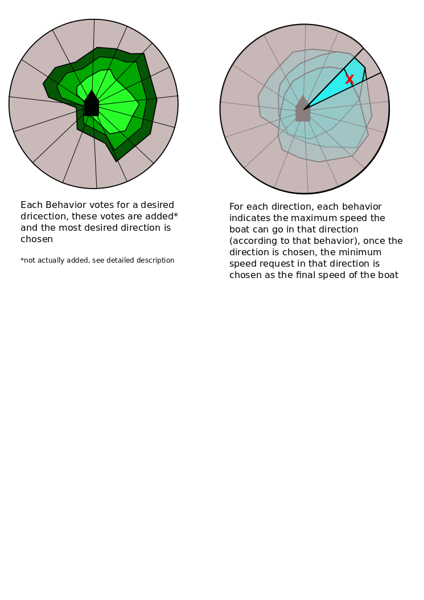

# OARS arbiter

### How it works

This arbiter is for an omni-directional boat, it controls heading, speed, and rotation rate. Heading is the first thing that is decided: each behavior indicates how preferable each heading is. These preferences are scaled based on weights for each behavior, then combined to find the overall most preferable heading. For each heading, each behavior indicates how fast it would like to go in that direction. After the heading is decided, the arbiter looks through all of the speed votes associated with that heading and takes the minimum. This way any behavior can dictate the actual speed of the boat. Finally, turn rate is an independent variable. Each behavior votes for various turn rates in a single array, using the same voting style as the heading votes, and the most prefered turn rate is chosen.

### Usage:

Run the arbiter script, then place votes using the helper functions which you can import in python using `from oars_arbiter.voter import <vote_type>`.

note: you need to run `catkin_make` after you download this code.

There are various voter types so that you can pass the minimum amount of information from each behavior to the arbiter. For example, if you are navigating somewhere and you don't care about boat speed (or would always choose max speed), you can just vote on the boat's direction, and not on speed or turn rate, by using `Voter_dir`

`Voter_full` takes all possible inputs. The votes are defined as follows:

- `dir_vote`: direction vote (101 element array), on a scale from -1 to 1, where -1 will override all other behaviors and refuse to go there, while 1 will override all other behaviors and force the boat to go there. The 50th element is the vote for forward. The maximum value for obstacle avoid should be (-)0.99. This will mean that no combination of votes below 0.9 will override the obstacle avoid (for up to about 8 behaviors). So in general, votes should be between -0.9 and 0.9, and special cases can still override obstacle avoid with a vote over 0.99. The direction vote defaults to the most recent heading.
- `speed_vote`: speed vote (101 element array), on a scale from 0 to 100. These votes are tied to the heading represented by their index. Once the heading is decided, only that heading's associated speed votes are considdered. Vote for the maximum speed that behavior is comfortable going at each heading because the minimum speed is chosen. Also, avoid 0 votes unless you actually don't want to move.
- `turn_vote`: turn rate vote (51 element array), on the same -1 to 1 scale as the direction vote. the 25th element is the vote for continuing to point the same direction. If no one votes for a turn rate, the arbiter chooses it to turn towards the heading (aka point where we're going)

### Code Structure
#### Services
The services are defined in the `srv` folder, they define the different ways arbiter requests can be passed to the arbiter.

The code for handling the services is in `scripts/request_handler.py`

#### Helper functions
The helper functions are defined in `src/oars_arbiter/voter.py`. They are in that folder because it allows you to import them into any other piece of code using `from oars_arbiter.voter import <vote_type>`.

#### Scripts folder
arbiter is the only node which you actually need to run, behavior.py and reqest_handler.py are both imported into arbiter. They just contain classes and functions which are associated with behaviors and with managing services, while arbiter.py only contains code actually related to the arbiter decision making.

Also, `ex_pub.py` is just a piece of example code for how to import the voter helper functions and publish a vote to the arbiter.